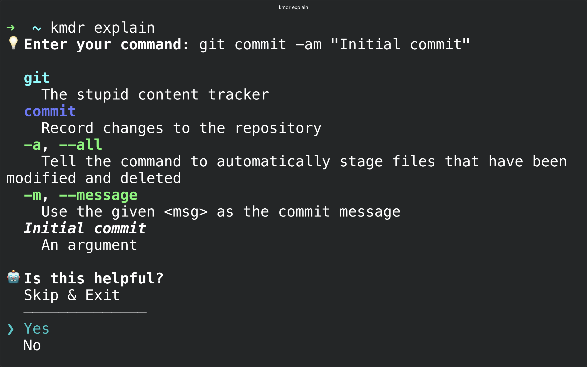

# kmdr-cli 

> The ultimate CLI learning tool for explaining commands from your terminal

<p align="center">
  
</p>

`kmdr` provides command explanations for hundreds of programs including `git`, `docker`, `kubectl`,`npm`, `go` and more straight forward programs such as those built into `bash`.

## Installation

### Requirements

- Node.js v8.x and above
- A package manager like `npm` or `yarn`

#### With `npm`

```bash
npm install kmdr@latest --global
```

#### With `yarn`

```bash
yarn global add kmdr@latest
```

#### With Homebrew 🍺 (only macOS)

```bash
brew install kommandr/tap/kmdr
```

### Check installation

Run the command `kmdr` to check if it was correctly installed on your system.

```
$ kmdr
Usage: kmdr [options] [command]

The ultimate CLI learning tool for explaining commands from your terminal

kmdr provides command explanations for hundreds of programs including git,
docker, kubectl, npm, go and more straight forward programs such as bash builtins.

Options:
  -v, --version        output the version number
  -h, --help           output usage information

Commands:
  explain|e [options]  Explain a shell command
  upgrade|u            Check for new releases
  feedback|f           Send feedback :)
```

#### Troubleshooting installation

##### Command not found: kmdr

Add the line below to your `.bashrc` or `.zshrc` if using `zsh`

```
export PATH="$(yarn global bin):$PATH"
```

### Running `kmdr` in a docker container

1. Build the image

   ```bash
   docker build -t kmdr-cli .
   ```

2. Run the docker container

   ```bash
   docker run -it --rm  kmdr-cli
   ```

## Usage

### Explain a command

Once `kmdr-cli` is installed on your system, enter `kmdr explain` to return a prompt for entering the command you would like explained.

When the `Enter your command:` prompt is returned, enter the command you would like explained and hit the `Enter` key.

`kmdr` will return syntax highlighting to assist you in differentiating parts of the command followed by the explanation of each of these parts.

An example explanation of `git commit -am "Initial commit"` can be seen below.

```
$ kmdr explain
? Enter your command: git commit -am "Initial commit"

    git commit -am "Initial commit"

  EXPLANATION
    git
      The stupid content tracker
    commit
      Record changes to the repository
    -a, --all
      Tell the command to automatically stage files that have been modified and deleted
    -m, --message Initial commit
      Use the given <msg> as the commit message

  EXAMPLES
    git reset HEAD~1
      Undo the most recent commit, keeping its changes in the filesystem

    git commit -m "Initial commit"
      Commit staged files to the repository with message "Initial commit"

    git log -n 3 --oneline
      Show only the first line of the last three commit messages

  RELATED PROGRAMS
    hg, lsof, systemctl, aria2c, dmesg, make
```

### Examples

#### Explaining commands with subcommands

```
$ kmdr explain
? Enter your command: npm install kmdr@latest --global

    npm install kmdr@latest --global

  EXPLANATION
    npm
      javascript package manager
    install
      Install a package
    kmdr@latest
      An operand
    -g, --global
      Argument will cause npm to install the package globally rather than locally.

  EXAMPLES
    npm install kmdr@latest --global
      Install kmdr on your machine

    npm install
      Download all the packages listed as dependencies in package.json

    npm list -g --depth=0
      List all top-level globally installed modules on the system

  RELATED PROGRAMS
    dpkg, pip, gem, node, cargo, install
```

#### Explanining commands with grouped options

```
$ kmdr explain
? Enter your command: rsync -anv file1 file2

    rsync -anv file1 file2

  EXPLANATION
    rsync
      A fast, versatile, remote (and local) file-copying tool
    -a, --archive
      This is equivalent to -rlptgoD.
    -n, --dry-run
      This makes rsync perform a trial run that doesn’t make any changes
      (and produces mostly the same output as a real run).
    -v, --verbose
      This option increases the amount of information you are given during
      the transfer.
    file1
      An operand
    file2
      An operand

  EXAMPLES
    rsync -av --progress sourceDir user@host:remotedDir
      Synchronize the remote folder "remoteDir" with directory "sourceDir"
      including file permissions and ownership

    rsync -ru remoteHost:remoteDir localDir
      Synchronize only updated files from remote host

  RELATED PROGRAMS
    ssh, ssh-copy-id, hostname, ansible-playbook, ansible, scp
```

#### Explaining commands with redireciton

```
$ kmdr explain
? Enter your command: ls -alh > contents.txt

    ls -alh > contents.txt

  EXPLANATION
    ls
      List directory contents
    -a, --all
      Do not ignore entries starting with .
    -l
      Use a long listing format
    -h, --human-readable
      With -l and/or -s, print human readable sizes (e.g., 1K 234M 2G)
    > contents.txt
      Redirect stdout to contents.txt.

  EXAMPLES
    ls -a
      List all files, including hidden files

    ls -lh
      Long format list with size displayed using human readable
      units (KB, MB, GB)

    ls -lS
      Long format list sorted by size (descending)

  RELATED PROGRAMS
    dir, sort, pwd, tree, find, mkdir
```

#### Explaining list of commands

```
$ kmdr explain
? Enter your command: dmesg | grep 'usb' > output.log 2>error.log

    dmesg | grep 'usb' > output.log 2> error.log

  EXPLANATION
    dmesg
      Print or control the kernel ring buffer
    |
      A pipe serves the sdout of the previous command as input (stdin) to the next one
    grep
      Print lines matching a pattern
    usb
      An operand
    > output.log
      Redirect stdout to output.log.
    2> error.log
      Redirect stderr to error.log.

  EXAMPLES
    Could not find any example

  RELATED PROGRAMS
    ifconfig, systemctl, iptables, ssh, nl, uniq, paste, sort,
```

### Sending feedback

```
$ kmdr feedback                                                                                                                                                   README*
? How can we help? Support for printing explanantions with different colors :)
? Email address: eddie@kmdr.sh
✔ Your feedback was saved. Thank you!
```

### Checking for updates

```
$ kmdr upgrade                                                                                                                                                    README*
  You have the latest version of kmdr-cli
```

## Supported programs

We add new programs every day!

### Bash/Bourne Shell Builtins

- `alias`
- `bg`
- `complete`
- `cd`
- `clear`
- `command`
- `declare`
- `disown`
- `echo`
- `eval`
- `exit`
- `export`
- `false`
- `fg`
- `hash`
- `history`
- `info`
- `jobs`
- `kill`
- `logout`
- `printf`
- `popd`
- `pushd`
- `pwd`
- `read`
- `readonly`
- `return`
- `readonly`
- `set`
- `sleep`
- `true`
- `unalias`
- `umask`


### Containers

- `docker`
- `docker-compose`
- `kata-runtime`
- `kubectl`
- `singularity`

### Database server and clients

- `mongod`
- `mongodump`
- `mysql`
- `mysqldump`
- `pg_ctl`
- `pg_dump`
- `pg_restore`
- `q`
- `sqlite3`

### Deployment / Cloud

- `aws`
- `ansible`
- `ansible-playbook`
- `az`
- `gcloud`
- `now`
- `openstack`
- `swift`


### File and Archiving

- `7z`
- `7zr`
- `basename`
- `chgrp`
- `chown`
- `chmod`
- `cmp`
- `cp`
- `dd`
- `df`
- `du`
- `duplicity`
- `fdupes`
- `file`
- `find`
- `fsarchiver`
- `ftp`
- `gunzip`
- `gzip`
- `link`
- `ln`
- `ls`
- `mkdir`
- `mktemp`
- `more`
- `mv`
- `openssl`
- `realpath`
- `rm`
- `rmdir`
- `rsync`
- `scp`
- `shred`
- `split`
- `stat`
- `tar`
- `touch`
- `tree`
- `unmask`
- `unlink`
- `watch`

### Media (audio/video)

- `ffmpeg`
- `youtube-dl`

### Network/Communication

- `curl`
- `dig`
- `host`
- `iptables`
- `ifconfig`
- `hostname`
- `nc`
- `ncat`
- `netstat`
- `nmcli`
- `nmap`
- `nslookup`
- `ping`
- `ssh`
- `sshd`
- `ssh-add`
- `ssh-copy-id`
- `ssh-keygen`
- `sshutle`
- `tcpdump`
- `telnet`
- `traceroute`
- `wget`

### Package managers

- `add-apt-repository`
- `apt`
- `apt-cache`
- `apt-key`
- `apt-get`
- `apt-mark`
- `aptitude`
- `bpkg`
- `cargo`
- `chcon`
- `dnf`
- `dpkg`
- `dpkg-query`
- `gem`
- `npm`
- `makepkg`
- `pip`
- `port`
- `pkg`
- `snap`
- `synaptic`
- `stack`
- `yarn`
- `yay`
- `yum`

### Programming Languages / Run time environments / Compilers

- `cobra`
- `gcc`
- `go`
- `java`
- `node`
- `nvm`
- `perl`
- `python`
- `rbenv`
- `ruby`
- `rails`
- `virtualenv`

### Sysadmin / Monitoring

- `adduser`
- `apachectl`
- `bmon`
- `chroot`
- `chsh`
- `crontab`
- `df`
- `dmesg`
- `finger`
- `free`
- `fusermount`
- `fsav`
- `groupadd`
- `halt`
- `hostnamectl`
- `htop`
- `install`
- `iperf`
- `iperf3`
- `journalctl`
- `killall`
- `localectl`
- `lsof`
- `lsb_release`
- `lsmod`
- `lspci`
- `lsusb`
- `mount`
- `nice`
- `nohup`
- `nproc`
- `numactl`
- `parted`
- `perf`
- `ps`
- `pstree`
- `pkill`
- `reboot`
- `shutdown`
- `sudo`
- `swapoff`
- `systemctl`
- `top`
- `uname`
- `umount`
- `useradd`
- `usermod`
- `visudo`
- `which`
- `who`
- `whois`
- `whoami`

### Time/Date

- `cal`
- `date`
- `time`

### Text Processing

- `awk`
- `cat`
- `column`
- `code`
- `cut`
- `diff`
- `egrep`
- `fold`
- `grep`
- `head`
- `less`
- `nl`
- `od`
- `sed`
- `sort`
- `shuf`
- `tail`
- `tr`
- `uniq`
- `wc`

### Text editors

- `code`
- `nano`
- `pgrep`
- `vi`
- `vim`

### Task Runner

- `gulp`

### Utilities

- `autossh`
- `age`
- `base64`
- `chrpath`
- `env`
- `exa`
- `fd`
- `fish`
- `fincore`
- `gh`
- `gnome-terminal`
- `gofmt`
- `gradlew`
- `gv`
- `id`
- `inxi`
- `jq`
- `kmdr`
- `neofetch`
- `md5sum`
- `mdbook`
- `npx`
- `openssl`
- `openvt`
- `pandoc`
- `pbcopy`
- `rclone`
- `reflector`
- `screen`
- `shellcheck`
- `seq`
- `sha1sum`
- `sha256sum`
- `strings`
- `terminator`
- `timeout`
- `tput`
- `uptime`
- `whereis`
- `w3m`
- `xxd`
- `xdg-open`
- `xdg-mime`
- `zapier`
- `zenity`
- `zsh`

### Virtualization

- `esxcli`
- `vagrant`

### Version Control

- `git`
- `hg`
- `repo`

### Miscellaneous

- `bash`
- `bash/sh`
- `conda`
- `dh`
- `firejail`
- `fortune`
- `fzf`
- `gpart`
- `gpg`
- `ncdu`
- `header`
- `hyperfine`
- `lsblk`
- `rgh`
- `rladmin`
- `smbclient`
- `tty`
- `ttyd`
- `yes`

## Stay tuned for more updates

- Visit our website <https://kmdr.sh/>
- Follow us on twitter <http://twitter.com/kmdr_sh>
