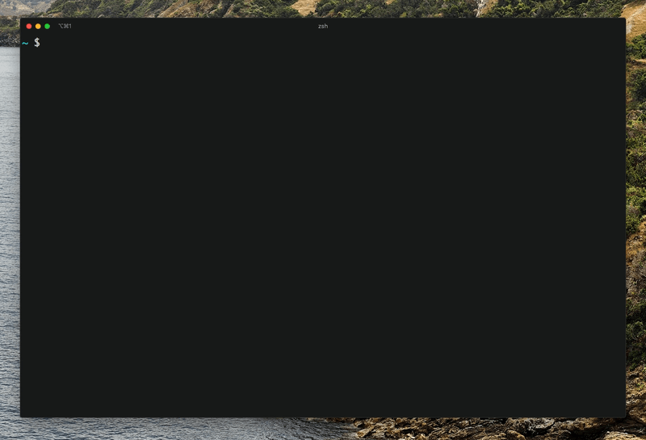

# kmdr.sh 

**The CLI client for explaining shell commands from your terminal**

`kmdr` provides command explanations for hundreds of programs including `git`, `docker`, `kubectl`,`npm`, `go` and more straight forward programs such as those built into `bash`.

<p align="center">
  
</p>

## Examples

### Explaining commands with subcommands

```
$ kmdr explain
💡 Enter your command: sudo npm install kmdr@latest --global

  sudo
    execute a command as another user
  npm
    javascript package manager
  install
    Install a package
  kmdr@latest
    An argument of the previous option
  -g, --global
    Argument will cause npm to install the package globally rather than locally.
```

### Explanining commands with grouped options

```
$ kmdr explain
💡 Enter your command: rsync -anv dir1 dir2

  rsync
    A fast, versatile, remote (and local) file-copying tool
  -a, --archive
    This is equivalent to -rlptgoD.
  -n, --dry-run
    This makes rsync perform a trial run that doesn’t make any changes (and produces mostly the same output as a real run).
  -v, --verbose
    This option increases the amount of information you are given during the transfer.
  dir1
    An argument
  dir2
    An argument
```

### Explaining commands with redireciton

```
$ kmdr explain
💡 Enter your command: ls -alh > contents.txt

  ls
    List directory contents
  -a, --all
    Do not ignore entries starting with .
  -l
    Use a long listing format
  -h, --human-readable
    With -l and/or -s, print human readable sizes (e.g., 1K 234M 2G)
  > contents.txt
    Redirect stdout to contents.txt.
```

### Explaining list of commands

```
$ kmdr explain
💡 Enter your command: cd git/ && git clone git@github.com:ediardo/kmdr.sh.git && git log

  cd
    Change working directory
  git/
    An argument of the previous option
  &&
    Command2 is executed if, and only if, command1 returns an exit status of zero

  git
    The stupid content tracker
  clone
    Clone a repository into a new directory
  git@github.com:ediardo/kmdr.sh.git
    An argument of the previous option
```

## Installation

### Requirements

- Node.js v8.x and above
- A package manager like `yarn` or `npm`

**With yarn**

```bash
yarn global add kmdr@latest
```

**With npm**

```bash
npm install kmdr --global
```

### Check installation

Run the command `kmdr` to check if it was correctly installed on your system.

```
$ kmdr
Usage: kmdr [options] [command]

The CLI client for explaining complex shell commands.

kmdr provides command explanations for hundreds of programs including git, docker, kubectl,npm, go and more straight forward programs such as those built into bash.

Options:
  -v, --version  output the version number
  -h, --help     output usage information

Commands:
  explain|e      Explain a shell command
```

#### Troubleshooting installation

##### Command not found: kmdr

Add the line below to your `.bashrc` or `.zshrc` if using `zsh`

```
export PATH="$(yarn global bin):$PATH"
```

### Running `kmdr` in a docker container

1. Build the image

   ```bash
   docker build -t kmdr-cli .
   ```

2. Run the docker container

   ```bash
   docker run -it --rm  kmdr-cli
   ```

## Usage

### Explain a command

Once kmdr is installed on your system, enter `kmdr explain` to return a prompt for entering the command you would like explained.

When the `Enter your command:` prompt is returned, enter the command you would like explained and hit the `Enter` key.

kmdr will return syntax highlighting to assist you in differentiating parts of the command followed by the explanation of each of these parts.

An example explanation of `git commit -am "Initial commit"` can be seen below.

```bash
$ kmdr explain
💡 Enter your command:  git commit -am "Initial commit"

  git commit -am "Initial commit"

  git
    The stupid content tracker
  commit
    Record changes to the repository
  -a, --all
    Tell the command to automatically stage files that have been modified and deleted
  -m, --message
    Use the given <msg> as the commit message
  Initial commit
    An argument

🤖 Is this helpful? Yes
🔥 Awesome! What did you like about this explanation?
✔ Your feedback was saved. Thank you!
Learn more at https://github.com/ediardo/kmdr.sh
```

### Supported programs

We add new programs every day.

#### Bash/Bourne Shell Builtins

| Program   | Options/flags coverage | Subcommands coverage |
| --------- | ---------------------- | -------------------- |
| `cd`      | -                      |                      |
| `clear`   | -                      |                      |
| `command` | -                      |                      |
| `pwd`     | -                      |                      |
| `readonly`| -                      |                      |
| `sleep`   | -                      |                      |
| `true `   | -                      |                      |


#### Containers

| Program          | Options/flags coverage | Subcommands coverage |
| ---------------- | ---------------------- | -------------------- |
| `docker`         | yes                    | partial              |
| `docker-compose` | yes                    | partial              |
| `dmesg`          | yes                    | -                    |
| `kubectl`        | yes                    | partial              |
| `singularity`    | yes                    | no                   |

#### Version Control

| Program | Options/flags coverage | Subcommands coverage |
| ------- | ---------------------- | -------------------- |
| `git`   | yes                    | partial              |

#### Database server and clients

| Program      | Options/flags coverage | Subcommands coverage |
| ------------ | ---------------------- | -------------------- |
| `mongod`     | yes                    | -                    |
| `mongodump`  | yes                    | -                    |
| `mysql`      | yes                    | -                    |
| `mysqldump`  | yes                    | -                    |
| `pg_ctl`     | yes                    | -                    |
| `pg_dump`    | yes                    | -                    |
| `pg_restore` | yes                    | -                    |
| `sqlite3`    | yes                    | -                    |

#### Deployment / Cloud

| Program              | Options/flags coverage | Subcommands coverage |
| -------------------- | ---------------------- | -------------------- |
| `now`                | yes                    | partial              |
| `ansible`            | yes                    | partial              |
| `ansible-playbook`   | yes                    | partial              |

#### File and Archiving

| Program    | Options/flags coverage | Subcommands coverage |
| ---------- | ---------------------- | -------------------- |
| `basename` | yes                    | -                    |
| `chgrp`    | yes                    | -                    |
| `chown`    | yes                    | -                    |
| `chmod`    | yes                    | -                    |
| `cmp`      | yes                    | -                    |
| `cp`       | yes                    | -                    |
| `dd`       | yes                    | -                    |
| `df`       | yes                    | -                    |
| `du`         | yes                    | -                    |
| `file`     | yes                    | -                    |
| `find`     | yes                    | -                    |
| `gunzip`   | yes                    | -                    |
| `gzip`     | yes                    | -                    |
| `ln`       | yes                    |                      |
| `ls`       | yes                    | -                    |
| `mkdir`    | yes                    | -                    |
| `mktemp`   | yes                    | -                    |
| `more`     | yes                    | -                    |
| `mv`       | yes                    | -                    |
| `openssl`  | yes                    | partial              |
| `realpath` | yes                    | -                    |
| `rm`       | yes                    | -                    |
| `rmdir`    | yes                    | -                    |
| `rsync`    | yes                    | -                    |
| `scp`      | yes                    | -                    |
| `split`    | yes                    | -                    |
| `stat`     | yes                    | -                    |
| `tar`      | yes                    | -                    |
| `touch`    | yes                    | -                    |
| `tree`     | yes                    | -                    |
| `unmask`   | yes                    | -                    |
| `watch`    | yes                    | -                    |

#### Media (audio/video)

| Program      | Options/flags coverage | Subcommands coverage |
| ------------ | ---------------------- | -------------------- |
| `ffmpeg`     | yes                    | -                    |
| `youtube-dl` | yes                    | -                    |

#### Network/Communication

| Program       | Options/flags coverage | Subcommands coverage |
| ------------- | ---------------------- | -------------------- |
| `dig`         | yes                    | -                    |
| `host`        | yes                    | -                    |
| `iptables`    | yes                    | -                    |
| `ifconfig`    | yes                    | -                    |
| `hostname`    | yes                    | -                    |
| `netstat`     | yes                    | -                    |
| `nmap`        | yes                    | -                    |
| `nslookup`    | yes                    | -                    |
| `ping`        | yes                    | -                    |
| `ssh`         | yes                    | -                    |
| `ssh-add`     | yes                    | -                    |
| `ssh-copy-id` | yes                    | -                    |
| `ssh-keygen`  | yes                    | -                    |
| `tcpdump`     | yes                    | -                    |
| `telnet`      | yes                    | -                    |
| `traceroute`  | yes                    | -                    |

#### Package managers

| Program       | Options/flags coverage | Subcommands coverage |
| ------------- | ---------------------- | -------------------- |
| `apt`         | yes                    | -                    |
| `cargo`       | yes                    | -                    |
| `dpkg`        | yes                    | -                    |
| `dpkg-query`  | yes                    | -                    |
| `gem`         | yes                    | -                    |
| `npm`         | yes                    | yes                  |
| `pip`         | yes                    | yes                  |
| `yarn`        | yes                    | yes                  |

#### Programming Languages / Run time environments / Compilers

| Program      | Options/flags coverage | Subcommands coverage |
| ------------ | ---------------------- | -------------------- |
| `gcc`        | yes                    | -                    |
| `go`         | yes                    | partial              |
| `node`       | yes                    | -                    |
| `perl`       | no                     | -                    |
| `python`     | yes                    | -                    |
| `ruby`       | yes                    | -                    |
| `virtualenv` | yes                    | -                    |

#### Sysadmin / Monitoring

| Program       | Options/flags coverage | Subcommands coverage |
| ------------- | ---------------------- | -------------------- |
| `adduser`     | yes                    | -                    |
| `chroot`      | yes                    | -                    |
| `chsh`        | yes                    | -                    |
| `crontab`     | yes                    | -                    |
| `df`          | yes                    | -                    |
| `free`        | yes                    | -                    |
| `groupadd`    | yes                    | -                    |
| `halt`        | yes                    | -                    |
| `htop`        | yes                    | -                    |
| `install`     | yes                    | -                    |
| `iperf`       | yes                    | -                    |
| `iperf3`      | yes                    | -                    |
| `jobs`        | yes                    | -                    |
| `journalctl`  | yes                    | -                    |
| `kill`        | yes                    | -                    |
| `killall`     | yes                    | -                    |
| `lsof`        | yes                    | -                    |
| `lsb_release` | yes                    | -                    |
| `mount`       | yes                    | -                    |
| `nice`        | yes                    | -                    |
| `nohup`       | yes                    | -                    |
| `nproc`       | yes                    | -                    |
| `ps`          | yes                    | -                    |
| `shutdown`    | yes                    | -                    |
| `sudo`        | yes                    | -                    |
| `systemctl`   | yes                    | -                    |
| `top`         | yes                    | -                    |
| `uname`       | yes                    | -                    |
| `visudo`      | yes                    | -                    |
| `which`       | yes                    | -                    |
| `who`         | yes                    | -                    |
| `whoami`      | yes                    | -                    |

#### Time/Date

| Program | Options/flags coverage | Subcommands coverage |
| ------- | ---------------------- | -------------------- |
| `cal`   | -                      | -                    |
| `date`  | -                      | -                    |
| `time`  | -                      | -                    |

#### Text Processing

| Program  | Options/flags coverage | Subcommands coverage |
| -------- | ---------------------- | -------------------- |
| `awk`    | -                      | -                    |
| `cat`    | yes                    | -                    |
| `column` | yes                    | -                    |
| `cut`    | yes                    | -                    |
| `diff`   | yes                    | -                    |
| `grep`   | yes                    | -                    |
| `head`   | yes                    | -                    |
| `less`   | yes                    | -                    |
| `nl`     | yes                    | -                    |
| `od`     | yes                    | -                    |
| `sed`    | yes                    | -                    |
| `sort`   | yes                    | -                    |
| `tail`   | yes                    | -                    |
| `tr`     | yes                    | -                    |
| `uniq`   | yes                    | -                    |
| `wc`     | yes                    | -                    |

#### Text editors

| Program | Options/flags coverage | Subcommands coverage |
| ------- | ---------------------- | -------------------- |
| `code`  | -                      | -                    |
| `nano`  | -                      | -                    |
| `vi`    | -                      | -                    |
| `vim`   | -                      | -                    |

#### Task Runner
| Program   | Options/flags coverage | Subcommands coverage |
| --------- | ---------------------- | -------------------- |
| `gulp`    | yes                    | -                    |


#### Utilities

| Program     | Options/flags coverage | Subcommands coverage |
| ----------- | ---------------------- | -------------------- |
| `autossh`   | yes                    | -                    |
| `base64`    | yes                    | -                    |
| `curl`      | yes                    | -                    |
| `echo`      | yes                    |                      |
| `env`       | yes                    | -                    |
| `export`    | yes                    |                      |
| `false`     | yes                    | -                    |
| `gofmt`     | yes                    | -                    |
| `history`   | yes                    |                      |
| `id`        | yes                    | -                    |
| `jq`        | yes                    | -                    |
| `kmdr`      | yes                    | yes                  |
| `md5sum`    | yes                    | -                    |
| `openssl`   | yes                    | partial              |
| `pandoc`    | yes                    | -                    |
| `printf`    | yes                    | -                    |
| `read`      | yes                    | -                    |
| `screen`    | yes                    | -                    |
| `seq`       | yes                    | -                    |
| `sha1sum`   | yes                    | -                    |
| `sha256sum` | yes                    | -                    |
| `strings`   | yes                    | -                    |
| `timeout`   | yes                    | -                    |
| `uptime`    | yes                    | -                    |
| `wget`      | yes                    | -                    |
| `whereis`   | yes                    | -                    |

#### Virtualization

| Program   | Options/flags coverage | Subcommands coverage |
| --------- | ---------------------- | -------------------- |
| `vagrant` | yes                    | -                    |

#### Version Control

| Program   | Options/flags coverage | Subcommands coverage |
| --------- | ---------------------- | -------------------- |
| `hg`      | yes                    | -                    |

#### Miscellaneous

| Program   | Options/flags coverage | Subcommands coverage |
| --------- | ---------------------- | -------------------- |
| `bash`    | yes                    | -                    |
| `bash/sh` | yes                    | -                    |
| `conda`   | yes                    | -                    |
| `gpg`     | yes                    | -                    |
| `tty`     | yes                    | -                    |


## Stay tuned for more updates

- Visit our website https://kmdr.sh/
- Follow us on twitter http://twitter.com/kmdr_sh
