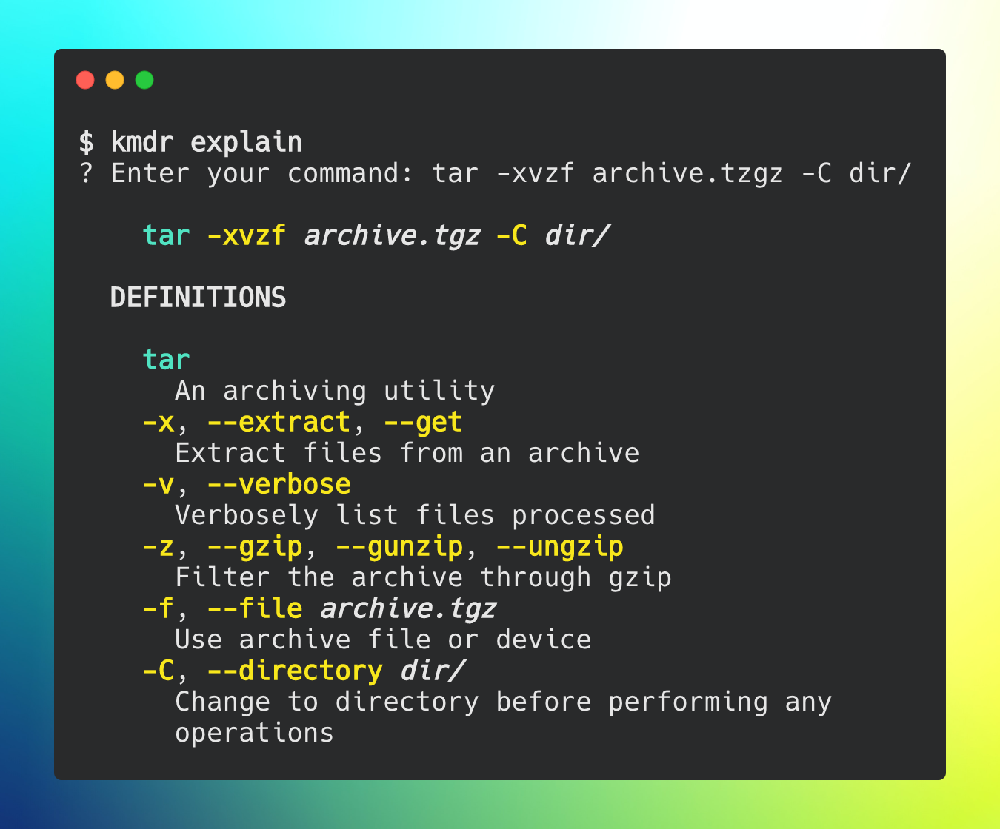

# kmdr.sh 


**The CLI client for explaining shell commands from your terminal**

`kmdr` provides command explanations for hundreds of programs including `git`, `docker`, `kubectl`,`npm`, `go` and more straight forward programs such as those built into `bash`.



## Requirements

- Node.js v8.x and above
- A package manager like `yarn` or `npm`

## Installation

**With yarn**

```bash
yarn global add kmdr@latest
```

**With npm**

```bash
npm install kmdr --global
```

### Check installation

Run the command `kmdr` to check if it was correctly installed on your system.

```
$ kmdr
Usage: kmdr [options] [command]

The CLI client for explaining complex shell commands.

kmdr provides command explanations for hundreds of programs including git, docker, kubectl,npm, go and more straight forward programs such as those built into bash.

Options:
  -v, --version  output the version number
  -h, --help     output usage information

Commands:
  explain|e      Explain a shell command
```

#### Troubleshooting installation

##### Command not found: kmdr

Add the line below to your `.bashrc` or `.zshrc` if using `zsh`

```
export PATH="$(yarn global bin):$PATH"
```

## Usage

### Explain a command

Once kmdr is installed on your system, enter `kmdr explain` to return a prompt for entering the command you would like explained.

When the `Enter your command:` prompt is returned, enter the command you would like explained and hit the `Enter` key.

kmdr will return syntax highlighting to assist you in differentiating parts of the command followed by the explanation of each of these parts.

An example explanation of `git commit -am "Initial commit"` can be seen below.

```bash
$ kmdr explain
💡 Enter your command:  git commit -am "Initial commit"

  git commit -am "Initial commit"

  git
    The stupid content tracker
  commit
    Record changes to the repository
  -a, --all
    Tell the command to automatically stage files that have been modified and deleted
  -m, --message
    Use the given <msg> as the commit message
  Initial commit
    An argument

🤖 Is this helpful? Yes
🔥 Awesome! What did you like about this explanation?
✔ Your feedback was saved. Thank you!
Learn more at https://github.com/ediardo/kmdr.sh
```

### Supported programs

We add new programs every day.

#### Bash builtins

| Program | Options/flags coverage | Subcommands coverage 
| --- | --- | --- |
| `cd` |  | |
| `echo` | yes | |
| `false` | - | - |
| `export` | yes | |
| `history` | yes ||
| `true` | - | - |

#### Other Commands

| Program | Options/flags coverage | Subcommands coverage 
| --- | --- | --- |
| `base64` | yes | |
| `basename` | yes |
| `cat` | yes | | 
| `bash` | yes | |
| `cat` | yes | |
| `chgrp` | yes | |
| `chmod`  | yes | |
| `cmp` | yes | |
| `column` | yes | |
| `cp` | yes | |
| `crontab` | yes | |
| `curl` | yes | |
| `df` | yes | |
| `diff` | yes | |
| `docker`| yes | partial | 
| `docker-compose` | yes | partial |
| `dpkg` | yes | |
| `du` | yes | |
| `env` | yes | |
| `false` | yes | |
| `find` | yes | |
| `free` | yes | |
| `gcc` | yes | |
| `git` | yes | partial |
| `go` | yes | partial |
| `grep` | yes | |
| `head` | yes | |
| `hostname`| yes | |
| `id` | yes | 
| `journalctl` | yes | |
| `kmdr` | yes | yes |
| `kubectl` | yes | partial |
| `less` | yes | |
| `ln`| yes | |
| `ls` | yes | |
| `md5sum` | yes | |
| `mv` | yes | |
| `netstat` | yes | |
| `node` | yes | |
| `now` | yes | partial |
| `npm` | yes | partial |
| `openssl` | yes | partial |
| `ping` | yes | |
| `pip` | yes | yes |
| `python` | yes | |
| `rm`  | yes | |
| `rmdir` | yes | |
| `rsync` | yes | |
| `scp` | yes | |
| `sleep` | yes | |
| `sort` | yes | |
| `sqlite` | yes | |
| `ssh`  | yes | |
| `ssh-add`  | yes | |
| `ssh-copy-id` | yes | |
| `ssh-keygen` | yes | |
| `sudo`  | yes | |
| `tail` | yes | |
| `tar`  | yes | |
| `top`  | yes | |
| `uniq` | yes | |
| `virtualenv`  | yes | |
| `watch`  | yes | |
| `wc`  | yes | |
| `wget`  | yes | |
| `yarn`  | yes | partial |

## Stay tuned for more updates

- Visit our website https://kmdr.sh/
- Follow us on twitter http://twitter.com/kmdr_sh

